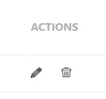

# Prueba Tecnica Frontend

## Solicitan prueba técnica en Dynamiza TIC.

## Url de despliegue: https://deploy.d1cxfleynqsozg.amplifyapp.com/

## Consiste en la creación de una vista frontal para el backend https://github.com/aramossanchez/prueba_tecnica_backend/tree/deploy


## Pre-requisitos del proyecto para hacerlo funcionar en tu equipo local:

* Instalar **Nodejs** en nuestro equipo, descargándolo de su página oficial
https://nodejs.org/

* Clonar el proyecto en nuestro equipo con git bash:
```
$git clone 'url-del-repositorio'
```

* Instalar todas las dependecias con el siguiente comando:
```
npm install
```

* Arrancamos el servidor con el siguiente comando:
```
npm start
```

## Tecnologías utilizadas en el proyecto:

* **react**: Instalamos react en nuestro proyecto:
```
npm install react
```
* **axios**: Instalamos axios en nuestro proyecto, para poder hacer consultas a la API:
```
npm install axios
```
* **sass**: Instalar sass en el proyecto (css mejorado, con nuevas funcionalidades)
```
npm install sass
```
## Estructura del proyecto:
* Al acceder a la aplicación nos lleva directamente a la pantalla principal, en la que se nos mostrará los registros de orders existentes en la base de datos

* Podemos crear un nuevo registro pulsando el botón "NEW RECORD".

<br>
Al pulsarlo, nos aparece una pantalla en la que podremos introducir los datos del registro, un botón para guardar el registro en la base de datos y un boton para cerrar la pantalla.


* Podemos buscar registros dentro del listado completo con diferentes opciones de búsqueda:

    * En el cuadro donde pone "Search" podremos indicar el ORDER ID del order que estamos buscando (no es necesario introducir el id completo, esta opción buscará entre todos los registros existentes si el código que introducimos está incluido en su ORDER ID). Pulsamos el botón "SEARCH" y nos filtrará todos los resultados.
    * En el desplegable de Status podremos filtrar por el status que seleccionemos. Pulsamos el botón "SEARCH" y nos filtrará todos los resultados.
    * En el desplegable de Types podremos filtrar por el type que seleccionemos. Pulsamos el botón "SEARCH" y nos filtrará todos los resultados.
    * Al pulsar el botón "SEARCH" nos aparecerá un nuevo botón, "CLOSE SEARCH". Al pulsarlo, eliminamos todos los filtros hechos y el programa nos mostrará todos los registros de nuevo.
* Dentro de cada registro podremos realizar 2 acciones sobre el propio registro: actualizar sus datos o borrarlo de la base de datos.
    * 
    * Actualizar datos de order: Al pulsar el lápiz, nos aparece una pantalla en la podremos ver los datos del order, modificarlos, un botón para guardar los cambios en la base de datos y un boton para cerrar la pantalla.
    
    * Borrar order: Al pulsar la papelera borramos el registro de la base de datos.
* Existe la posibilidad de navegar entre las páginas de registros. Cada página muestra 10 registros (a no ser que no existan más de 10 registros disponibles), y podemos navegar entre ellas pulsando en el botón de la página a la que queramos ir o con las flechas que existen a los laterales de los números.

